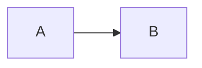

# Guia de Contribuição

Este documento descreve os padrões adotados pela equipe para manter a documentação do projeto organizada, consistente e de fácil manutenção.

---

# Objetivo

Garantir que todos os artefatos produzidos durante o Discovery sigam uma estrutura padronizada, facilitando a leitura, revisão e evolução da documentação.

---

# Estrutura do Projeto

```text
FIAP-TCC/
│
├── README.md
├── CONTRIBUTING.md
│
├── docs/
│   ├── 00-Contexto-do-Projeto.md
│   ├── 01-CSD.md
│   ├── 02-Desk-Research.md
│   ├── 03-Pesquisa-Quantitativa.md
│   ├── ...
│
├── assets/
│   ├── images/
│   ├── diagrams/
│   └── pesquisa/
│
└── anexos/
```

---

# Convenções de Nomenclatura

Todos os documentos devem seguir a numeração sequencial das etapas do Discovery.

Exemplos:

```text
00-Contexto-do-Projeto.md
01-CSD.md
02-Desk-Research.md
03-Pesquisa-Quantitativa.md
04-Entrevistas.md
```

Evite alterar a numeração dos arquivos, pois ela representa a ordem cronológica do processo.

---

# Estrutura dos Documentos

Sempre que possível, os documentos devem seguir a estrutura abaixo.

```markdown
# Título

## Objetivo

## Contexto

## Desenvolvimento

## Principais Evidências

## Insights

## Impacto nas Próximas Etapas

## Conclusão
```

Nem todas as seções são obrigatórias. A estrutura pode ser adaptada conforme a natureza do artefato.

---

# Escrita

Durante a elaboração da documentação:

- utilizar linguagem objetiva;
- evitar opiniões sem evidências;
- apresentar fatos antes de conclusões;
- justificar decisões sempre que possível;
- manter consistência entre os documentos.

---

# Diagramas

Os diagramas do projeto devem ser escritos utilizando **Mermaid**.

Exemplo:

````text
