# Discovery — Projeto Care Plus

## Sobre este repositório

Este repositório reúne toda a documentação produzida durante a fase de **Discovery** do projeto desenvolvido no MBA **Gestão Estratégica de Negócios e Inteligência Artificial**, da FIAP, em parceria com a **Care Plus**.

O objetivo é documentar, de forma estruturada e rastreável, todo o processo de entendimento do problema, validação de hipóteses, pesquisa com usuários e construção dos artefatos que fundamentam a proposta de solução apresentada pela equipe.

Mais do que apresentar o resultado final, esta documentação registra o processo utilizado para chegar às decisões tomadas ao longo do projeto.

---

# Objetivos

- Documentar todas as etapas do Discovery.
- Centralizar os artefatos produzidos pela equipe.
- Garantir rastreabilidade entre pesquisas, hipóteses e decisões.
- Facilitar futuras revisões e apresentações.
- Servir como documentação viva durante o desenvolvimento do projeto.

---

# Estrutura da Documentação

| Documento | Descrição |
|-----------|-----------|
| 00-Contexto-do-Projeto.md | Contextualização do desafio, objetivos, escopo e premissas do projeto. |
| 01-CSD.md | Levantamento inicial de certezas, suposições e dúvidas da equipe. |
| 02-Desk-Research.md | Pesquisa secundária utilizada para fundamentar as hipóteses do projeto. |
| 03-Pesquisa-Quantitativa.md | Pesquisa realizada com usuários, análise estatística e validação das hipóteses. |
| 04-Analise-Qualitativa.md | Consolidação das respostas abertas da pesquisa e identificação dos principais insights qualitativos. |
| 05-Mapa-de-Empatia.md | Construção do mapa de empatia a partir das evidências coletadas. |
| 06-Persona.md | Persona consolidada durante o processo de Discovery. |
| 07-Definicao-do-Problema.md | Definição do problema validado pela equipe. |
| 08-Problem-Solution-Fit.md | Validação do alinhamento entre o problema identificado e a oportunidade de solução. |
| 09-Value-Proposition-Canvas.md | Construção da proposta de valor baseada nas evidências obtidas durante o Discovery. |
| 10-Business-Model-Canvas.md | Estruturação inicial do modelo de negócio. |
| 11-Modelo-de-Negocio.md | Descrição detalhada da lógica de geração de valor da solução. |
| 12-TAM-SAM-SOM.md | Estimativa do mercado potencial da solução. |
| 13-Tipos-de-Inovacao.md | Classificação da inovação proposta. |
| 14-Business-Case.md | Consolidação da viabilidade da solução proposta. |

---

# Fluxo do Discovery

```mermaid
flowchart LR

A[CSD]
-->B[Desk Research]
-->C[Pesquisa Quantitativa]
-->D[Análise Qualitativa]
-->E[Mapa de Empatia]
-->F[Persona]
-->G[Definição do Problema]
-->H[Problem-Solution Fit]
-->I[Value Proposition Canvas]
-->J[Business Model Canvas]
-->K[Modelo de Negócio]
-->L[TAM / SAM / SOM]
-->M[Tipos de Inovação]
-->N[Business Case]
```



Cada etapa utiliza como entrada os resultados produzidos na etapa anterior, garantindo que todas as decisões sejam fundamentadas em evidências coletadas durante o processo de Discovery.

---

# Como visualizar esta documentação

Esta documentação utiliza recursos avançados do Markdown, incluindo diagramas **Mermaid**.

O preview nativo do Visual Studio Code não renderiza corretamente todos esses recursos.

Para uma visualização completa, recomenda-se utilizar:

- **Visual Studio Code**
- Extensão **Markdown Preview Enhanced**

Marketplace:

https://marketplace.visualstudio.com/items?itemName=shd101wyy.markdown-preview-enhanced

Após instalar a extensão:

1. Abra qualquer arquivo `.md`.
2. Execute o comando:

```text
Markdown Preview Enhanced: Open Preview
```

---

# Tecnologias Utilizadas

- Markdown
- Mermaid
- Visual Studio Code
- Markdown Preview Enhanced

---

# Organização do Repositório

```text
FIAP-TCC/
│
├── README.md
├── CONTRIBUTING.md
│
├── docs/
│   ├── 00-Contexto-do-Projeto.md
│   ├── 01-CSD.md
│   ├── 02-Desk-Research.md
│   ├── 03-Pesquisa-Quantitativa.md
│   ├── 04-Analise-Qualitativa.md
│   ├── ...
│
├── assets/
│   ├── images/
│   ├── diagrams/
│   └── pesquisa/
│
└── anexos/
```

---

# Informações do Projeto

| Item | Valor |
|------|-------|
| Instituição | FIAP |
| Curso | MBA Gestão Estratégica de Negócios e Inteligência Artificial |
| Empresa Parceira | Care Plus |
| Metodologia | Design Thinking + Lean Startup |
| Fase | Discovery |