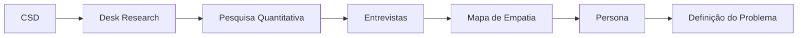
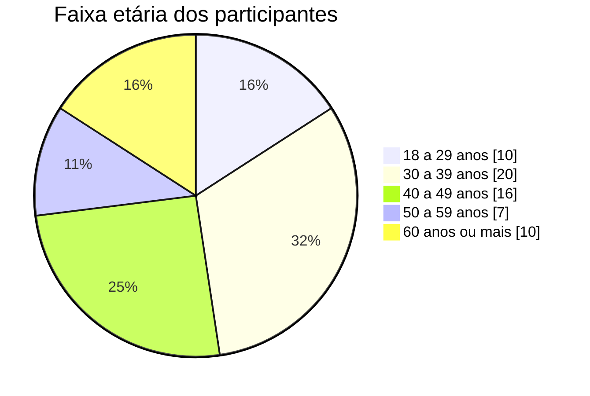
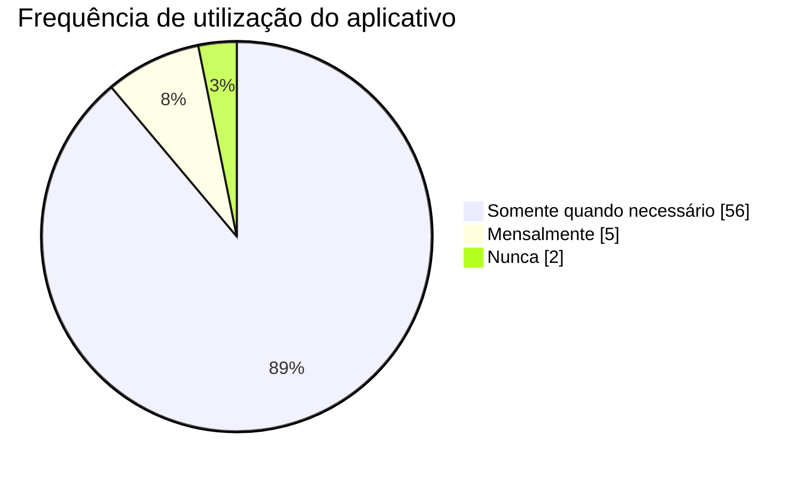
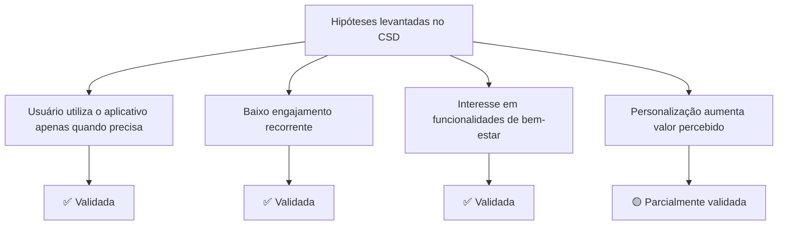
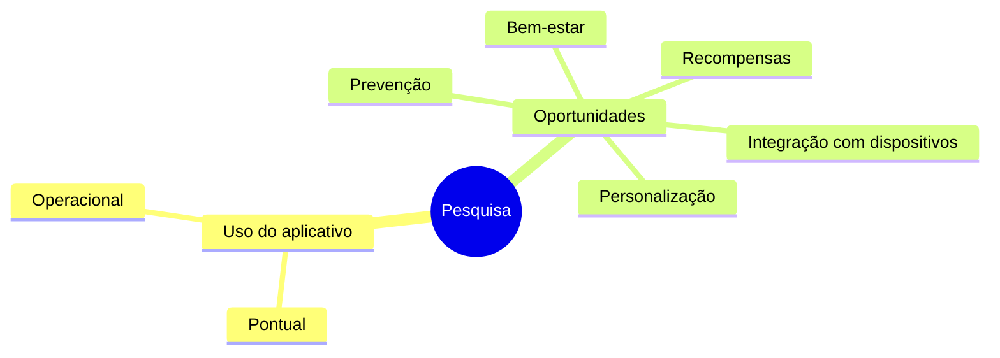

# Pesquisa Quantitativa

## Objetivo

Após o levantamento das hipóteses no CSD e a realização do Desk Research, foi conduzida uma pesquisa quantitativa com o objetivo de validar as principais hipóteses do projeto e compreender o comportamento de usuários de planos de saúde em relação aos aplicativos disponibilizados pelas operadoras.

As evidências obtidas nesta etapa serviram como base para a construção da Persona, do Mapa de Empatia, da Definição do Problema e da Proposta de Valor.

---

# Relação com o Processo de Discovery

---

# Contexto

Durante o desenvolvimento do projeto, a equipe não possuía acesso direto aos beneficiários da Care Plus.

Como alternativa, foi realizada uma pesquisa com pessoas que possuem plano de saúde e apresentam perfil semelhante ao público esperado, permitindo validar hipóteses de forma exploratória.

Embora os resultados não representem exclusivamente os clientes da Care Plus, eles fornecem evidências importantes sobre o comportamento de usuários de planos de saúde.

---

# Objetivos da Pesquisa

A pesquisa buscou responder às seguintes perguntas:

- Como os usuários utilizam aplicativos de planos de saúde?
- Quais funcionalidades são mais utilizadas?
- Os aplicativos fazem parte da rotina dos usuários?
- Quais fatores limitam seu uso?
- Quais funcionalidades aumentariam o valor percebido?
- Existe interesse em recursos voltados à prevenção e bem-estar?

---

# Metodologia

| Item | Descrição |
|------|-----------|
| Tipo | Pesquisa Quantitativa |
| Instrumento | Google Forms |
| Coleta | Online |
| Total de respostas | **71** |
| Respondentes com plano de saúde | **63** |

---

# Perfil da Amostra

## Distribuição por faixa etária

### Análise

A maior parte dos respondentes encontra-se entre 30 e 49 anos, perfil compatível com usuários economicamente ativos e frequentemente beneficiários de planos de saúde empresariais.

---

# Principais Resultados

## Utilização de aplicativos de saúde

Dos participantes que possuem plano de saúde:

- 30 utilizam aplicativos de saúde;
- 33 não utilizam.

### Insight

Mesmo entre pessoas que possuem plano de saúde, o uso de aplicativos especializados ainda não faz parte da rotina da maioria dos usuários.

---

## Frequência de utilização do aplicativo

### Análise

O aplicativo é utilizado predominantemente quando existe uma necessidade específica, como localizar médicos, consultar exames ou solicitar autorizações.

### Insight

O comportamento observado confirma que o aplicativo possui caráter predominantemente **transacional**, não sendo utilizado de forma recorrente.

---

## Funcionalidades mais utilizadas

As funcionalidades mais utilizadas pelos participantes foram:

- Carteirinha digital;
- Busca por médicos;
- Autorizações;
- Reembolsos;
- Consulta de exames;
- Telemedicina.

### Insight

Todas as funcionalidades estão relacionadas à resolução de demandas pontuais, indicando pouca interação contínua com a plataforma.

---

## Valor percebido do aplicativo

A maior parte dos participantes atribuiu notas baixas quando questionada se o aplicativo oferece valor além das funcionalidades tradicionais do plano de saúde.

### Insight

Existe oportunidade para ampliar a percepção de valor oferecendo recursos que acompanhem a rotina do usuário, e não apenas momentos de utilização do plano.

---

## Funcionalidades desejadas

Os recursos mais citados foram:

- Programas de recompensas;
- Metas de saúde;
- Monitoramento de atividades físicas;
- Integração com smartwatch;
- Recomendações personalizadas;
- Nutrição;
- Saúde mental.

### Insight

Os participantes demonstram interesse em funcionalidades voltadas ao cuidado contínuo da saúde, reforçando as tendências identificadas durante o Desk Research.

---

# Validação das Hipóteses

---

# Principais Descobertas

A pesquisa confirmou que:

- o aplicativo é utilizado principalmente para resolver necessidades imediatas;
- existe baixo engajamento recorrente;
- usuários demonstram interesse por funcionalidades voltadas à prevenção e qualidade de vida;
- há oportunidade para aumentar o valor percebido do aplicativo por meio de experiências personalizadas.

---

# Limitações

A pesquisa possui caráter exploratório.

Os participantes pertencem a diferentes operadoras de planos de saúde e não representam exclusivamente a base de beneficiários da Care Plus.

Os resultados foram utilizados como evidências para apoiar o processo de Discovery, e não como uma amostra estatisticamente representativa da empresa.

---

# Impacto nas Próximas Etapas

As evidências obtidas nesta pesquisa foram utilizadas para:

- validar hipóteses levantadas no CSD;
- apoiar a construção da Persona;
- elaborar o Mapa de Empatia;
- definir o problema central do projeto;
- fundamentar a Proposta de Valor.

---

# Conclusão

A pesquisa quantitativa confirmou que os aplicativos de planos de saúde ainda são percebidos principalmente como ferramentas operacionais, utilizadas apenas quando existe uma necessidade específica.

Ao mesmo tempo, os resultados evidenciaram uma oportunidade para ampliar o papel do aplicativo na rotina dos usuários por meio de funcionalidades voltadas à prevenção, bem-estar e personalização.

Essas evidências serviram como principal insumo para as próximas etapas do Discovery, reduzindo a dependência de hipóteses e direcionando as decisões da equipe com base em dados coletados junto ao público pesquisado.