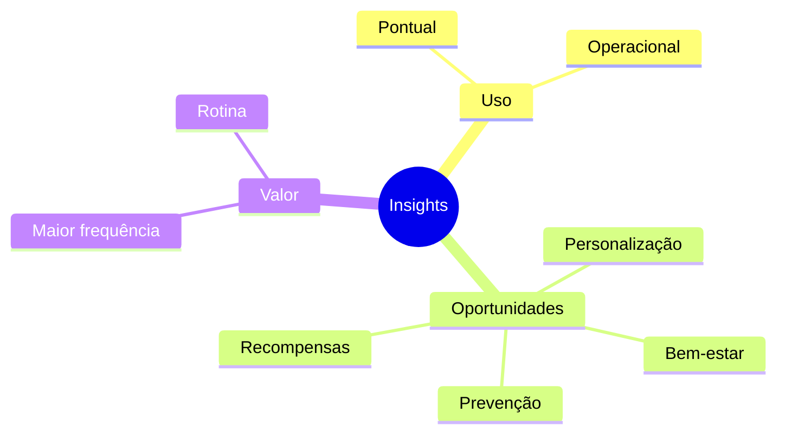

# Análise Qualitativa

## Objetivo

Complementar os resultados obtidos na pesquisa quantitativa por meio da análise das respostas abertas fornecidas pelos participantes, buscando compreender as motivações, expectativas e percepções que não poderiam ser capturadas apenas por dados numéricos.

---

# Contexto

Embora a pesquisa quantitativa tenha permitido validar hipóteses importantes, as respostas abertas forneceram informações adicionais sobre o comportamento dos usuários e ajudaram a compreender as razões por trás dos resultados observados.

Devido à impossibilidade de entrevistar beneficiários da Care Plus, essa análise passou a representar a principal fonte qualitativa do projeto.

---

# Metodologia

As respostas discursivas foram analisadas utilizando uma abordagem de agrupamento por afinidade.

Inicialmente todas as respostas foram lidas individualmente.

Posteriormente foram identificados padrões recorrentes, agrupando comentários semelhantes em temas comuns.

Essa técnica permitiu identificar oportunidades recorrentes percebidas pelos participantes.

---

# Temas Identificados

## Uso apenas quando necessário

Grande parte das respostas indica que o aplicativo somente é aberto quando existe alguma necessidade específica.

Exemplos:

- consultar médicos;
- solicitar autorização;
- acessar exames;
- utilizar a carteirinha digital.

### Insight

O aplicativo ainda não faz parte da rotina do usuário.

---

## Pouco valor no dia a dia

Diversos participantes relataram que não encontram motivos para utilizar o aplicativo fora de situações relacionadas ao plano de saúde.

### Insight

Existe oportunidade para aumentar o valor percebido por meio de funcionalidades de uso contínuo.

---

## Interesse em prevenção

Os participantes demonstraram interesse por funcionalidades relacionadas a:

- atividade física;
- alimentação;
- saúde mental;
- acompanhamento de metas.

### Insight

Os usuários desejam que o aplicativo participe do cuidado contínuo da saúde.

---

## Personalização

Muitos participantes sugeriram recomendações mais alinhadas ao seu perfil.

### Insight

Experiências personalizadas tendem a aumentar a percepção de utilidade da plataforma.

---

# Síntese dos Insights

---

# Relação com a Pesquisa Quantitativa

A análise qualitativa reforçou os principais resultados observados na pesquisa quantitativa.

Enquanto os dados quantitativos mostraram **o que** os usuários fazem, as respostas abertas ajudaram a compreender **por que** esse comportamento ocorre.

Essa combinação fortaleceu a confiança nas conclusões obtidas durante o Discovery.

---

# Impacto nas Próximas Etapas

Os insights identificados nesta etapa foram utilizados para:

- construção do Mapa de Empatia;
- definição da Persona;
- refinamento da Definição do Problema;
- elaboração da Proposta de Valor.

---

# Conclusão

A análise qualitativa complementou as evidências quantitativas, permitindo compreender aspectos subjetivos relacionados ao comportamento dos usuários.

Os resultados reforçam que o desafio do projeto não consiste apenas em ampliar funcionalidades, mas em transformar o aplicativo em uma plataforma relevante para o acompanhamento contínuo da saúde e do bem-estar.