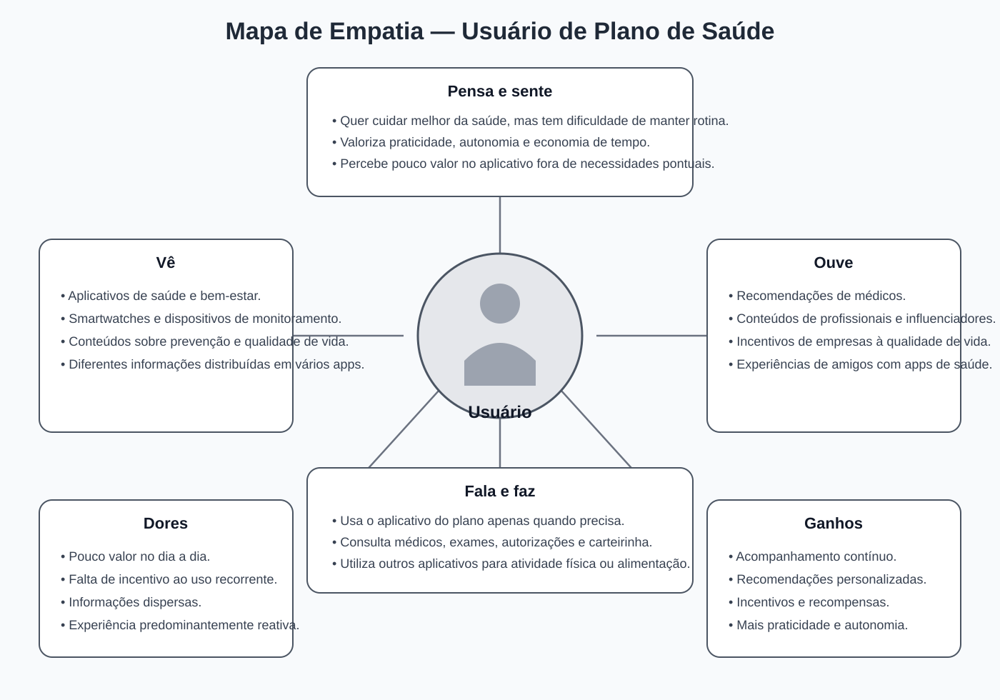

# Mapa de Empatia

## Objetivo

Consolidar a compreensão sobre o comportamento, as necessidades, as dores e as expectativas dos usuários, utilizando as evidências obtidas no CSD, no Desk Research, na Pesquisa Quantitativa e na Análise Qualitativa.

O Mapa de Empatia serviu como base para a construção da Persona e para a definição do problema abordado pelo projeto.

---

## Perfil analisado

O mapa foi construído considerando o perfil predominante identificado durante a pesquisa:

- adultos entre 30 e 49 anos;
- pessoas que possuem plano de saúde;
- usuários que acessam o aplicativo da operadora de forma esporádica;
- pessoas que valorizam praticidade e autonomia;
- usuários interessados em prevenção e qualidade de vida.

---

## Representação visual

---

## Pensa e sente

- Quer cuidar melhor da saúde, mas nem sempre consegue manter uma rotina.
- Valoriza praticidade, autonomia e economia de tempo.
- Deseja ter maior controle sobre sua saúde e qualidade de vida.
- Espera que a tecnologia facilite sua rotina sem exigir esforço adicional.
- Percebe pouco valor no aplicativo além dos serviços tradicionais do plano de saúde.

---

## Vê

- Crescimento de aplicativos voltados à saúde e ao bem-estar.
- Smartwatches e dispositivos que monitoram indicadores de saúde.
- Conteúdos relacionados à prevenção e à qualidade de vida.
- Informações de saúde distribuídas em diferentes aplicativos e serviços.

---

## Ouve

- Recomendações de médicos para manter hábitos saudáveis.
- Profissionais e influenciadores falando sobre alimentação e atividade física.
- Empresas incentivando programas de qualidade de vida.
- Amigos compartilhando experiências com aplicativos de saúde.

---

## Fala e faz

- Utiliza o aplicativo apenas quando precisa resolver uma demanda específica.
- Consulta médicos, exames, autorizações e a carteirinha digital.
- Utiliza outros aplicativos para acompanhar atividades físicas ou alimentação.
- Demonstra preferência por soluções simples e rápidas.

---

## Dores

- O aplicativo oferece pouco valor no dia a dia.
- Não existem incentivos claros para acessá-lo regularmente.
- As informações estão dispersas em diferentes aplicativos.
- A experiência é reativa e concentrada em momentos de necessidade.
- O usuário precisa buscar sozinho informações e orientações relevantes.

---

## Necessidades

- Acompanhar sua saúde em um único ambiente.
- Receber recomendações relevantes para seu perfil.
- Criar e manter hábitos saudáveis.
- Visualizar sua evolução ao longo do tempo.
- Receber incentivos para manter uma rotina de cuidados.

---

## Ganhos esperados

- Melhor controle sobre a própria saúde.
- Maior praticidade e autonomia.
- Experiência personalizada.
- Recompensas por hábitos saudáveis.
- Utilização mais frequente e relevante do aplicativo.

---

## Principais insights

A construção do Mapa de Empatia evidenciou que o principal desafio não está apenas na ausência de funcionalidades, mas na falta de motivos para que o usuário incorpore o aplicativo à sua rotina.

Os participantes demonstraram interesse por soluções que auxiliem na prevenção, no acompanhamento contínuo da saúde e na criação de hábitos saudáveis, desde que essas funcionalidades sejam simples, personalizadas e agreguem valor real ao dia a dia.

Também foi identificado que o usuário já utiliza diferentes recursos digitais para cuidar da saúde. Portanto, a oportunidade não está necessariamente em introduzir um comportamento completamente novo, mas em integrar informações, reduzir a fragmentação e tornar o aplicativo da operadora mais relevante.

---

## Impacto nas próximas etapas

Os insights obtidos nesta etapa foram utilizados para:

- construir a Persona;
- definir o problema central do projeto;
- identificar oportunidades de geração de valor;
- orientar a elaboração do Value Proposition Canvas.

---

## Conclusão

O Mapa de Empatia consolidou as principais percepções obtidas durante o Discovery e permitiu compreender o comportamento dos usuários de forma mais ampla.

As evidências apontam uma oportunidade de transformar o aplicativo da Care Plus em uma plataforma mais presente na jornada de saúde do beneficiário, ampliando o valor percebido e incentivando um relacionamento mais frequente com a operadora.